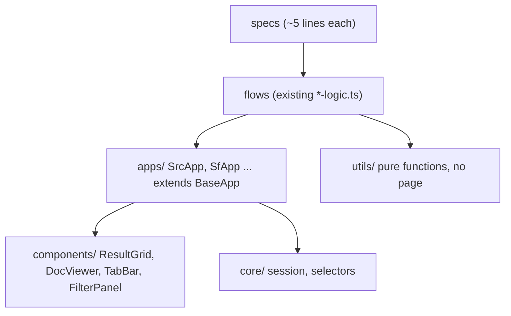

# POM Architecture Proposal

> **Status:** proposal / discussion document. **No code has been changed.**
> Nothing here is implemented until you approve it.

---

## Ground rules for this refactor

These are non-negotiable constraints for every change that follows:

1. **No behavior changes.** Ever. This is *relocation and dedupe only*.
2. **`waitForTimeout` stays.** All 181 of them, same durations, same positions.
3. **Selectors are moved character-for-character.** Never "improved", never
   swapped for a "more stable" alternative, even obfuscated ones like
   `_icon_1jkal_249` or `___KmIbJ`.
4. **No new assertions, validations, retries, or error handling.**
5. **No reordering of operations.** Click order, wait order, tab order all stay.
6. **If it works today, it must do the exact same thing tomorrow.**

The acceptance test for any migrated file: *the browser does the identical
sequence of actions it did before.* If a refactor changes runtime behavior, the
refactor is wrong and gets reverted.

---

## 1. Why change anything

Measured across all **86 `.ts` files** under `tests/`:

| Duplicated thing | Files containing it |
| --- | --- |
| `ensureLoggedIn` | 45 |
| `storageState: AUTH_PATH` | 42 |
| `setupLogger` | 40 |
| `page.waitForTimeout` | 38 files (181 calls) |
| `div[data-test="resultRow"]` scraping | 36 |
| `updateGoogleSheet` | 35 |
| `.ReactVirtualized__Grid` | 29 |
| obfuscated CSS classes (`___KmIbJ`) | 22 |
| `Docs:` tab XPath | 18 |
| `View` button lookup | 18 |

- **logic code:** 10,784 lines
- **spec code:** 2,834 lines across 46 specs (avg **61.6 lines/spec**)

Two concrete bugs already caused by this duplication:

- The doc-view timeout bug fixed on 2026-08-09 existed **identically in two
  files** (`src-docView-logic.ts` and `src-outline-logic.ts`), because the code
  was copy-pasted. One fix had to be applied twice.
- The AA suite had *already* independently solved a closely-related doc-view
  timeout months earlier. SRC never got that knowledge, because there was no
  shared component to put it in.
- `src-docView.spec.ts` still declares `test.describe("SF-Indexing ...")` and
  logs to `SF/Daily-Test-Cases` — a copy-paste artifact from the SF suite.

**The goal is exactly this: write it once, so a fix lands once.**

---

## 2. What is actually shared (measured, not guessed)

### Shared across nearly every app

| Control / helper | App folders using it |
| --- | --- |
| Search button | **11** |
| `ensureLoggedIn`, `AUTH_PATH` | **11** |
| Clear Filters button | **10** |
| `getTabText` | **10** |
| `closeAllOpenTabs` | **10** |
| `setupLogger` | 10 |
| `fillAndEnter` | 9 |
| `parseCount` | 8 |
| `getTargetDateString` | 7 |
| `configureDisplayColumns` | 6 |

### NOT shared — each app's own filter

| App | Its unique filter locator |
| --- | --- |
| SF | `#Forms` |
| SRC | `#LawsAndRegs` |
| DBM | `#WordCount` |
| AOE | `#AND` |
| BPC / DBM | `#container-dropdown` (shared by exactly 2) |

**Conclusion:** the *app shell* is shared by everyone; the *filters* are
per-app. That is precisely the shape that a base class + subclasses fits.

---

## 3. Proposed structure

```
tests/
  core/
    BaseApp.ts            <- shared shell: search, clear, tabs, grid, docviewer
    session.ts            <- ensureLoggedIn, AUTH_PATH  (uses page, not a screen)
    selectors.ts          <- obfuscated CSS class constants, one place
  components/
    ResultGrid.ts         <- virtualized grid scroll + row iteration
    DocViewer.ts          <- open doc, wait for load
    TabBar.ts             <- "Docs: N" tabs, close tabs, crash screen
    FilterPanel.ts        <- checkbox/popup filter interactions
  apps/
    SrcApp.ts             <- extends BaseApp, adds lawsAndRegs
    SfApp.ts              <- extends BaseApp, adds forms
    ... one per app
  utils/
    format.ts             <- parseCount, parseCurrency, stripAnsi, ...
    logger.ts             <- setupLogger
    sheets.ts             <- updateGoogleSheet
  SRC/
    src-docView-logic.ts  <- flow: unchanged sequence, now calls components
    src-docView.spec.ts   <- ~5 lines
```

Layering:



---

## 4. The rule: base class vs utils

One question decides it every time:

> **Does it need `page`, and does it represent something on screen?**
> **Yes → base class / component. No → utils.**

### Goes in `BaseApp` (needs `page`, is on screen, shared by many apps)

| Member | Why |
| --- | --- |
| `searchBtn` | 11 apps |
| `clearFiltersBtn` | 10 apps |
| `tabs` (TabBar) | 10 apps |
| `grid` (ResultGrid) | 29 files |
| `docViewer` (DocViewer) | doc-view flows |
| `configureDisplayColumns()` | 6 apps |

### Goes in `utils/` (pure functions — never touch the browser)

| Function | Why |
| --- | --- |
| `parseCount`, `parseCurrency` | string → number |
| `getTargetDateString`, `getRandomIndices` | pure computation |
| `stripAnsi`, `cleanErrorMessage` | string formatting |
| `formatRowFinding`, `formatScenarioReport` | report building |
| `setupLogger` | filesystem, not browser |
| `updateGoogleSheet` | network, not browser |

**The clean line: utils never take a `page`.** Today `helpers.ts` mixes both,
which is why it is 640+ lines and why essentially every file imports it.

### Edge cases that do *not* follow the simple rule

| Thing | Where it goes | Why |
| --- | --- | --- |
| `ensureLoggedIn` | `core/session.ts` | Takes `page`, but is **not** part of any app's screen. It is session bootstrap, shared by all 11 apps. Putting it on `BaseApp` would imply "an app can log itself in", which is wrong — login happens before any app exists. |
| `navigateToX()` (9 near-identical one-liners) | each subclass's `navigate()` | They differ only by the link text. They become one base method + a per-app `appLinkText`. |
| `navigateToSourceToTargetApp` | `core/session.ts` or a `Shell` helper | Operates across two apps, so it belongs to neither subclass. |
| `recoverFromAppCrash` (3 apps) | `TabBar` / `BaseApp` | Touches the shared crash screen (`Oops!`), which is shell-level. |
| `findResultRowByIndex` (AA only) | `ResultGrid` | Only 1 app uses it today, but it is pure grid logic and is exactly the kind of thing other apps should have reused. |
| `#container-dropdown` (BPC + DBM only) | a small shared mixin, **not** `BaseApp` | Used by 2 of 11 apps. Putting it on `BaseApp` would pollute 9 apps that never use it. |

---

## 5. Concrete examples

### 5.1 `BaseApp` — shared shell only

```ts
// tests/core/BaseApp.ts
import { Page } from "@playwright/test";
import { ResultGrid } from "../components/ResultGrid";
import { DocViewer } from "../components/DocViewer";
import { TabBar } from "../components/TabBar";

export abstract class BaseApp {
  readonly grid: ResultGrid;
  readonly docViewer: DocViewer;
  readonly tabs: TabBar;

  // Each subclass supplies the left-nav link text for its own app.
  protected abstract readonly appLinkText: string;

  constructor(protected readonly page: Page) {
    this.grid = new ResultGrid(page);
    this.docViewer = new DocViewer(page);
    this.tabs = new TabBar(page);
  }

  // Locators moved VERBATIM from the current code.
  get searchBtn() {
    return this.page.getByRole("button", { name: /^Search$/i }).first();
  }

  get clearFiltersBtn() {
    return this.page.getByRole("button", { name: /^Clear Filters$/i });
  }

  async navigate() {
    // same as navigateToSecuritiesRegulationAndCompliance() etc.
    await this.page.locator(`text=/${this.appLinkText}/i`).first().click();
  }

  async search() {
    await this.searchBtn.click();
  }
}
```

### 5.2 A subclass — only what is unique to that app

```ts
// tests/apps/SrcApp.ts
import { BaseApp } from "../core/BaseApp";

export class SrcApp extends BaseApp {
  protected readonly appLinkText = "Securities Regulation & Compliance";

  // #LawsAndRegs exists ONLY in SRC -> belongs here, not in BaseApp.
  get lawsAndRegsInput() {
    return this.page.locator("#LawsAndRegs").locator("input");
  }

  get lawsAndRegsPlusBtn() {
    // NOTE: obfuscated class kept exactly as-is, on purpose.
    return this.page.locator("#LawsAndRegs").locator("._icon_1jkal_249").first();
  }

  async selectAllLawsAndRegs() {
    await this.lawsAndRegsPlusBtn.click();
    await this.page
      .locator("div.styles__tabHeader___2qy2T")
      .filter({ hasText: "Select All" })
      .locator("label")
      .check();
    await this.page.getByRole("button", { name: "OK" }).click();
  }
}
```

### 5.3 `DocViewer` — the bug that had to be fixed twice

This is the strongest argument for the whole refactor. Today this logic is
duplicated in `src-docView-logic.ts` and `src-outline-logic.ts`.

```ts
// tests/components/DocViewer.ts
export class DocViewer {
  constructor(private readonly page: Page) {}

  async countContainers() {
    return this.page.locator('div[id="DocViewContainer"]').count();
  }

  // Behavior identical to the current waitForDocViewLoaded().
  async waitForLoaded(containersBefore: number, timeout = 30000) { /* ... */ }
}
```

Call site becomes:

```ts
const before = await app.docViewer.countContainers();
await viewBtn.click();
await app.docViewer.waitForLoaded(before, 30000);
```

**One definition. A future fix lands once, not twice.**

### 5.4 Spec files: 62 lines → 5

Today, repeated 46 times:

```ts
test.describe("SF-Indexing Automation - Isolated Mode", () => {   // wrong name!
  if (fs.existsSync(AUTH_PATH)) test.use({ storageState: AUTH_PATH });
  test("SF-Indexing", async ({ page }) => {
    const logToFile = setupLogger("sf-indexing", "SF/Daily-Test-Cases");
    await ensureLoggedIn(page, logToFile);
    await navigateToSecuritiesRegulationAndCompliance(page);
    await runSRCDocViewTest(page, logToFile);
  });
});
```

Proposed:

```ts
defineAppTest({
  name: "src-docView",
  logPath: "SRC/Daily-Test-Cases",
  app: SrcApp,
  run: runSRCDocViewTest,
});
```

`defineAppTest` performs the *same* steps in the *same* order: storageState →
logger → `ensureLoggedIn` → navigate → run. It just isn't retyped 46 times.
It also removes the whole class of copy-paste naming bugs.

### 5.5 Flow files keep their exact sequence

Only the locator source changes; the sequence does not.

```ts
// BEFORE
const lawsAndRegsPlsBtn = page.locator("#LawsAndRegs").locator("._icon_1jkal_249").first();
await lawsAndRegsPlsBtn.click();
await page.locator("div.styles__tabHeader___2qy2T")
  .filter({ hasText: "Select All" }).locator("label").check();
await page.getByRole("button", { name: "OK" }).click();
await searchBtn.click();

// AFTER
await app.selectAllLawsAndRegs();   // identical clicks, identical order
await app.search();
```

---

## 6. Edge cases and risks

### 6.1 Copies that are *not* identical

When merging duplicated blocks, some copies differ subtly. Example: AA's grid
scroll has `MAX_STAGNANT_SCROLLS` and 800/1000ms waits; SRC's has no stagnation
guard and uses 500ms.

**Policy: never silently pick a "better" version.** Options, in order of
preference:

1. Add an explicit parameter with defaults that reproduce each caller's current
   behavior:
   `scrape({ settleMs: 500, maxStagnantScrolls: undefined })`
2. If too divergent, keep two methods (`scrape()` / `scrapeWithStagnationGuard()`).
3. If still unclear, **leave that file alone.** Not every file must migrate.

A shared component must not quietly change any caller's timing.

### 6.2 `magic-runner` must keep working

`magic-runner.ts` imports logic functions directly and connects over CDP. Two
implications:

- Flow signatures stay `(page, logToFile)`; the app object is constructed
  *inside* the flow (`const app = new SrcApp(page)`), **or** an optional third
  parameter is added. Either way, existing magic-runner calls keep compiling.
- Page objects must never import from `@playwright/test` **fixtures**. Importing
  `expect` is fine (already proven safe outside the runner); calling
  `test()` / `test.describe()` at module scope is *not* — it throws
  `Playwright Test did not expect test.describe() to be called here`.

**This is why POM classes must live in plain `.ts` files, never in `.spec.ts`.**

### 6.3 Obfuscated CSS classes

`_icon_1jkal_249`, `___KmIbJ`, `_checkbox__icon_1xotg_257` are build-generated
and spread across 22 files.

**They are NOT being changed.** They are only *centralized* into
`core/selectors.ts` so that when a rebuild changes a hash, it is edited in one
place instead of 22. Same strings, same behavior.

### 6.4 `expect.timeout` interaction

`playwright.config.ts` sets `expect.timeout = 30000`. Any assertion inside a
component without an explicit timeout inherits it. Since components are moved
verbatim (including their explicit `{ timeout: N }` options), this does not
change. Just do not *drop* an explicit timeout while moving code.

### 6.5 Duplicate `id="DocViewContainer"`

The app renders multiple elements with the **same DOM id** and never unmounts
old ones. Any component built on it must use `.last()` / count-based logic, not
`#DocViewContainer`. This is documented in `helpers.ts` and must survive the
move into `DocViewer`.

### 6.6 `Daily-DataPoints-Sheets` is a different shape

That folder is batch/data-dump oriented rather than one-app-one-flow. It should
migrate **last**, or not at all. POM is not mandatory where it does not fit.

### 6.7 Risk of a big-bang rewrite

Migrating 86 files at once would be reckless and unreviewable.
Mitigation: incremental migration (section 7); old `helpers.ts` keeps working
throughout by re-exporting from its new home, so nothing breaks mid-migration.

---

## 7. Migration plan (incremental, reversible)

| Phase | Scope | Why |
| --- | --- | --- |
| 0 | Write `core/`, `components/`, one `SrcApp`. **Change no existing test.** | Pattern exists but nothing is at risk. |
| 1 | Migrate **SRC only** (4 flows). Run headed, compare against current behavior. | Small, well understood, already deeply debugged. |
| 2 | Review together. Adjust the pattern before it spreads. | Cheapest moment to change our minds. |
| 3 | Roll out app by app: SE → NAL → RO → AOE → DBM → BPC → AA → SF. | One reviewable PR each. |
| 4 | `defineAppTest` for spec boilerplate. | Mechanical, low risk. |
| 5 | `Daily-DataPoints-Sheets` if it fits. | Different shape; may stay as-is. |

Throughout: `utils/helpers.ts` re-exports from new locations, so un-migrated
files keep working untouched.

**Verification each phase:** run the migrated suite headed, confirm the same
rows processed, same pass/fail, no new timeouts. SRC is a good baseline because
its current state is known-good (9/9 rows, 0 timeouts, verified 2026-08-09).

---

## 8. Open questions for you

1. **Components as `BaseApp` properties (`app.grid.scrape()`) or standalone
   classes you construct?** I lean properties — every app has them anyway.
2. **Do flows construct their own app object, or receive it as a parameter?**
   Constructing internally keeps `magic-runner` call sites unchanged.
3. **`#container-dropdown` (BPC + DBM only): shared mixin, or duplicate in both
   subclasses?** Two copies may honestly be simpler than a mixin.
4. **Is SRC-first the right starting point,** or would you rather prove it on a
   suite you personally touch more often?
5. Should I strip the `isScenarioValid = false` line I added during the
   2026-08-09 doc-view fix, to keep that fix purely behavioral-neutral?
